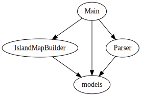

A homework example for [Zhihu live #989463080031543296](https://www.zhihu.com/lives/989463080031543296).

## Architecture

The homework consists with 4 modules:



### Main

The `Main` module performs I/O to produce required information. It uses `Parser` to load the sample data, and uses `IslandMapBuilder` to separate the grid into islands.

### models

The `models` module defines the types of grids.

### Parser

The `Parser` module loads grids from text.

### IslandMapBuilder

The `IslandMapBuilder` module analyzes the land grid and group it into islands. It uses depth first search to determine which positions belong to an island.
 
## Deployment

### System requirement

 * [Java 8](http://www.oracle.com/technetwork/java/javase/downloads/index.html)
 * [Scala 2.12.x](http://scala-lang.org/download/)
 * [Sbt 1.x](http://www.scala-sbt.org/download.html)

### Compiling

Run the following command-line at the root path of the homework:

```
sbt package
```

Now you will find that `target/scala-2.12/islandmap_2.12-1.0.0.jar` is built.

### Generating ScalaDoc

Run the following command-line at the root path of the homework:

```
sbt doc
```

Now you could navigate to `target/scala-2.12/api/index.html` to see the documentation.

### Testing

#### Unit test

Run the following command-line at the root path of the homework:

```
sbt test
```

This will run `IslandMapBuilderSpec` and `ParserSpec` in `src/test/scala`.

#### Test with an external input file

Run the following command-line at the root path of the homework:

```
sbt "run input.txt"
```

or

```
scala target/scala-2.12/islandmap_2.12-1.0.0.jar input.txt
```

Please verify if the output is the same as the expected output in the problem description.
